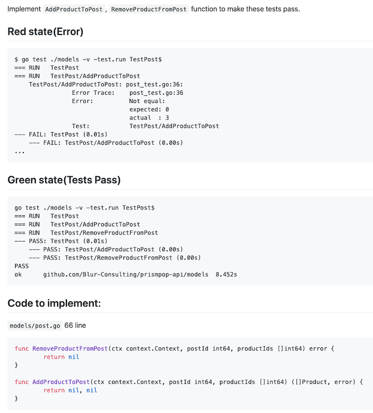

# Go coding skill 1


https://github.com/Blur-Consulting/prismpop-api/tree/code-challenge (private repository)



# Go coding skill 2

`longFunc` function执行需要很长时间。
请将代码修改 为持续执行2秒以上时，强制终止此application。


```go
package main

import (
	"fmt"
	"math/rand"
	"time"
)

func main() {
	elapsedTime := longFunc()
	fmt.Println(elapsedTime)

}
func longFunc() time.Duration {
	start := time.Now()
	duration := time.Duration(rand.New(rand.NewSource(time.Now().UnixNano())).Intn(5))
	time.Sleep(time.Second * duration)
	return time.Now().Sub(start)
}
```

# Architecture Design

请根据以下要求设计出能够显示page view count的架构。
要求:
1. count必须实时显示。 不得以小时为单位/日为单位统计并展示。
2. 在特定时间内,多次点击也仅为一次。
3. 当用户突然蜂拥而至时，60秒以内应该可以做到scale up。

